# Agile Devlopment with Azure Project: Building a CI/CD Pipeline

## Overview
This project demonstrates the advantages of automating DevOps with CI/CD pipelines.
A Machine Learning web application is built, test, and deployed using Github Actions and Azure pipelines.

The [project plan](#projectplan) is followed by [instructions](#instructions) that detail the following steps:

   * [Cloning and testing locallcy](#cloning-and-testing-locally)

   * [Deploying to Azure App Services](#deploying-to-azure-app-services)

   * [Setting up CI/CD using Azure Pipelines](#setting-up-cicd-using-azure-pipelines)

Further improvements to the project are discussed in [enhancements](#enhancements).

A short [demo](#demo) concludes the documentation.

## Status

[](https://github.com/imhofmi/flask-sklearn/actions/workflows/python-app.yml)

[](https://dev.azure.com/daimler-mic/ddpdev-azure-devops/_build/latest?definitionId=7205&branchName=main)

## Project Plan

The [yearly project plan](/projectplan/project-plan_2021.xlsx) depicts that DevOps automation is one essential step in the context of the overall project planned for Q2.

The [quarterly project plan](/projectplan/project-plan_2021_Q2.xlsx) details the steps necessary for building the CI-CD pipeline and estimates the week by week deliverables as well as the effort associated to each deliverable in T-Shirt-Sizes (S,M,L).

The [Trello board](https://trello.com/b/ppxOVR52/ml-application) is then used for task planning and tracking.


## Instructions

<TODO:  
* Architectural Diagram (Shows how key parts of the system work)>

<TODO:  Instructions for running the Python project.  How could a user with no context run this project without asking you for any help.  Include screenshots with explicit steps to create that work. Be sure to at least include the following screenshots:

* Project running on Azure App Service

* Project cloned into Azure Cloud Shell

* Passing tests that are displayed after running the `make all` command from the `Makefile`

* Output of a test run

* Successful deploy of the project in Azure Pipelines.  [Note the official documentation should be referred to and double checked as you setup CI/CD](https://docs.microsoft.com/en-us/azure/devops/pipelines/ecosystems/python-webapp?view=azure-devops).

* Running Azure App Service from Azure Pipelines automatic deployment

* Successful prediction from deployed flask app in Azure Cloud Shell.  [Use this file as a template for the deployed prediction](https://github.com/udacity/nd082-Azure-Cloud-DevOps-Starter-Code/blob/master/C2-AgileDevelopmentwithAzure/project/starter_files/flask-sklearn/make_predict_azure_app.sh).
The output should look similar to this:

```bash
udacity@Azure:~$ ./make_predict_azure_app.sh
Port: 443
{"prediction":[20.35373177134412]}
```

* Output of streamed log files from deployed application

> 

### Cloning and testing locally

Head to https://github.com and clone the repo https://github.com/imhofmi/flask-sklearn.
The following instructions will use the original repo, you should replace them with your cloned repo.

Login to Azure and open the Azure cloud shell.

Clone this project from github and change to the project directory:
```bash
azureuser@Azure:~$ git clone https://github.com/imhofmi/flask-sklearn.git
azureuser@Azure:~$ cd flask-sklearn
```

Create a virtual environment and source it:
```bash
azureuser@Azure:~/flask-sklearn$ make setup
azureuser@Azure:~/flask-sklearn$ source ~/.flask-sklearn/bin/activate
```

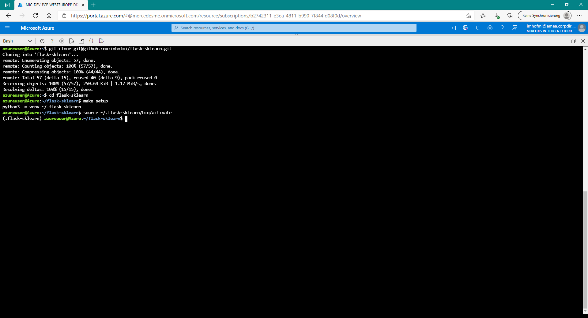


Build and install locally:
```bash
azureuser@Azure:~/flask-sklearn$ make all
```

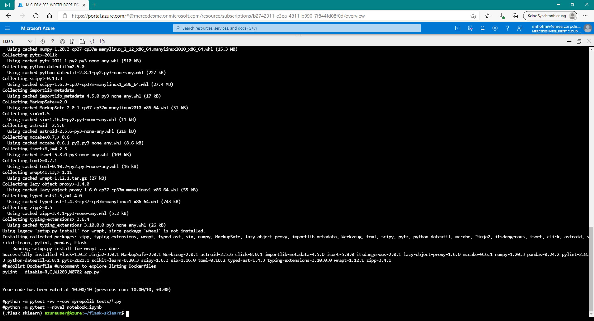


Run the application locally:
```bash
(.flask-sklearn) azureuser@Azure:~/flask-sklearn$ flask run
```

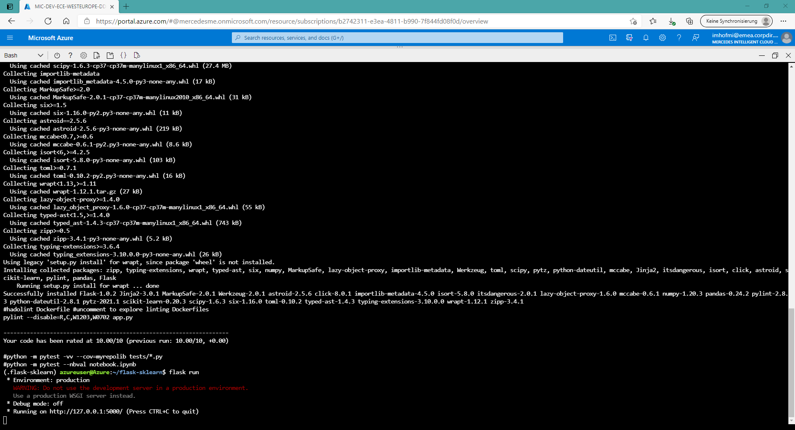

Test it locally in a new Azure cloud shell (as your first shell is blocked by 'flask run') :

```bash
azureuser@Azure:~$ source .flask-sklearn/bin/activate
(.flask-sklearn) azureuser@Azure:~$ cd flask-sklearn/
(.flask-sklearn) azureuser@Azure:~/flask-sklearn$ ./make_prediction.sh
```

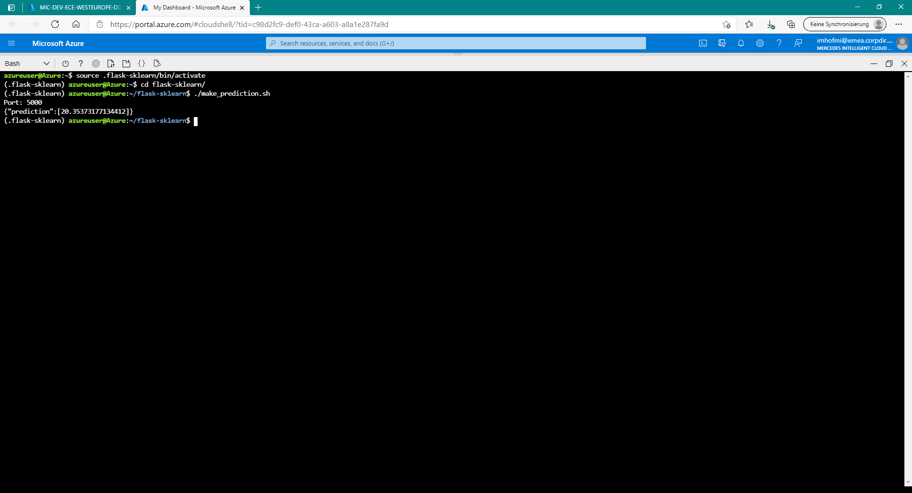

Close the second cloud shell and stop flask by hitting CRTL-C in the first cloud shell.


### Deploying to Azure App Services
Install the app to Azure app services using the free tier:

```bash
(.flask-sklearn) azureuser@Azure:~/flask-sklearn$ az webapp up -n flask-sklearn --sku F1
```

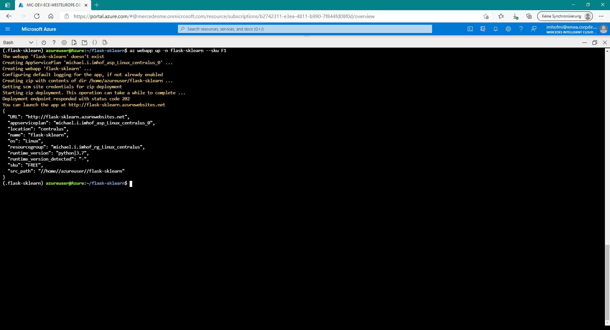

Check it the app is up and running by opening the URL containing the webapp name provided in the previous step: https://flask-sklearn.azurewebsites.net/

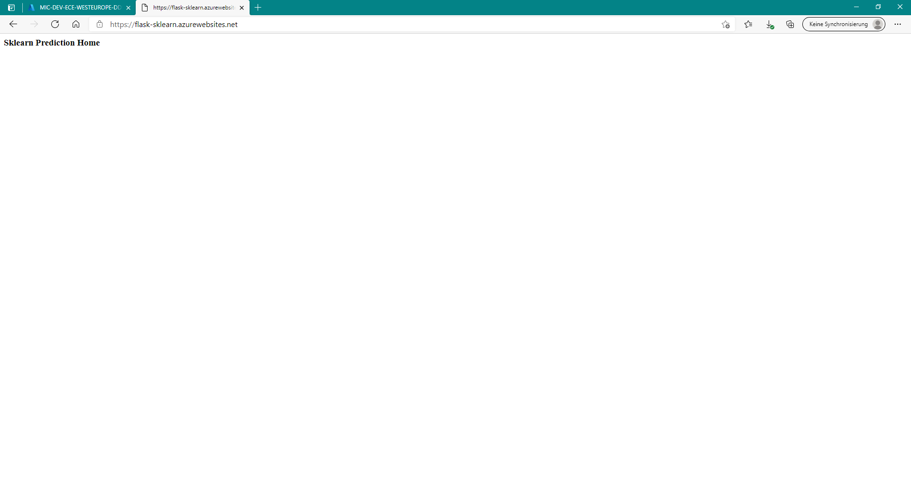

Edit file 'make_predict_azure_app.sh' and relace '<yourappname>' with your webapp name (e.g. flask-sklearn).

Test the remote webapp:

```bash
(.flask-sklearn) azureuser@Azure:~/flask-sklearn$ ./make_predict_azure_app.sh
```

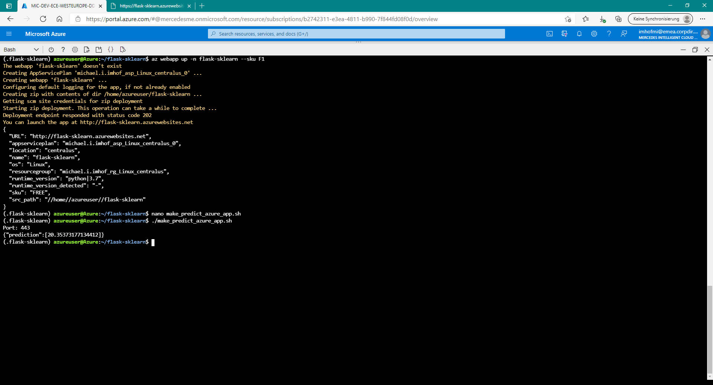

### Setting up CI/CD using Azure Pipelines

At the time of writing the following steps were sufficient to setup a pipeline.
As things change quite fast in a cloud environment please consult the [official documentation provided by Microsoft](https://docs.microsoft.com/en-us/azure/devops/pipelines/ecosystems/python-webapp?view=azure-devops) in case of unclarities.

Open Azure devops in a browser https://dev.azure.com.

Creating a new project or selecting an existing project.

Head to Pipelines and click on 'New pipeline'.

When you are asked 'Where is your code?' select Github and choose your cloned repo.

Configure your pipeline as a "Python to Linux Web App on Azure", select your subscription and the webapp name you used to deploy the webapp earlier (e.g. flask-sklearn).
Click on 'Validate and configure'.

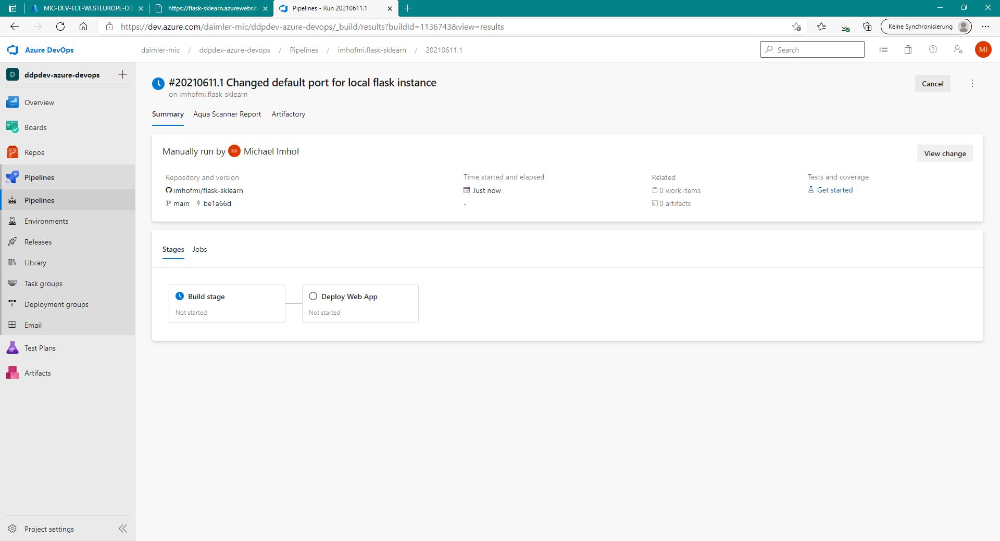

Under 'Pipelines' you should now see a first successfull run of the pipeline including the 'Build stage' and the 'Deploy Web App' stage:

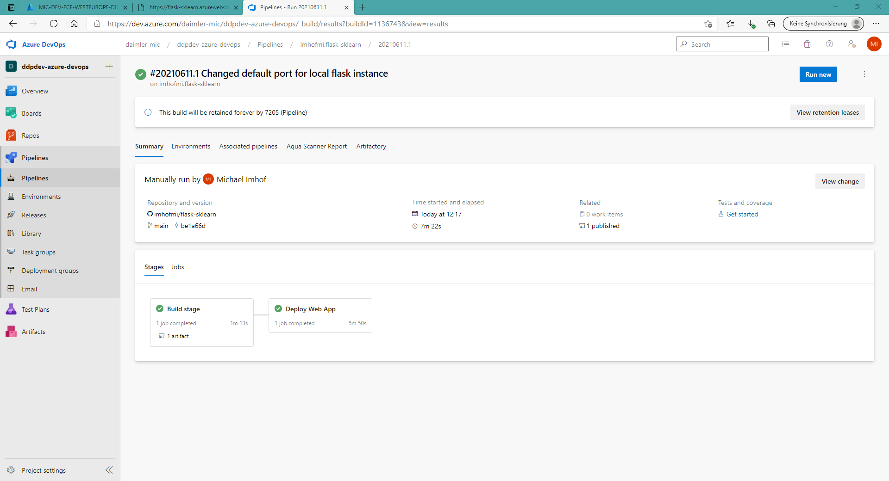

From now on every change to your code will trigger the CI/CD pipeline and update your webapp accordingly:

Change the application name in app.py from 'Sklearn Prediction Home' to 'Sklearn Prediction Home via Azure CI/CD Pipeline' and commit it:
```bash
(.flask-sklearn) azureuser@Azure:~/flask-sklearn$ nano app.py
(.flask-sklearn) azureuser@Azure:~/flask-sklearn$ git add app.py
(.flask-sklearn) azureuser@Azure:~/flask-sklearn$ git commit -m "Changed application name"
(.flask-sklearn) azureuser@Azure:~/flask-sklearn$ git push
```

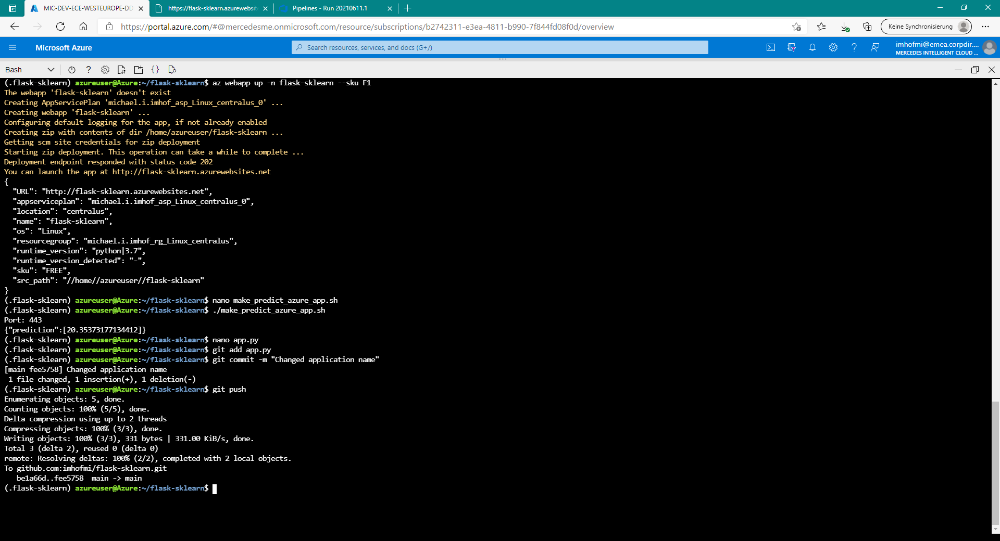

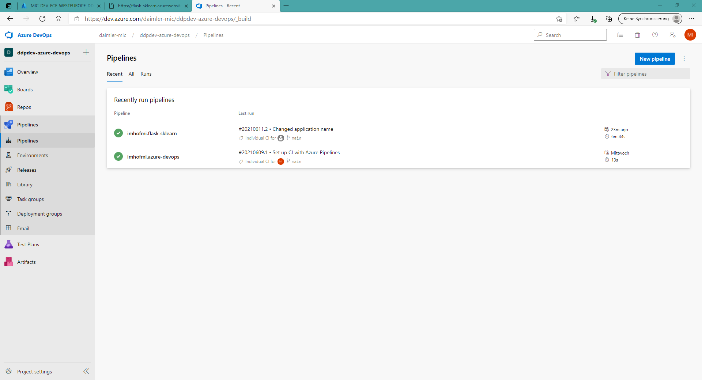

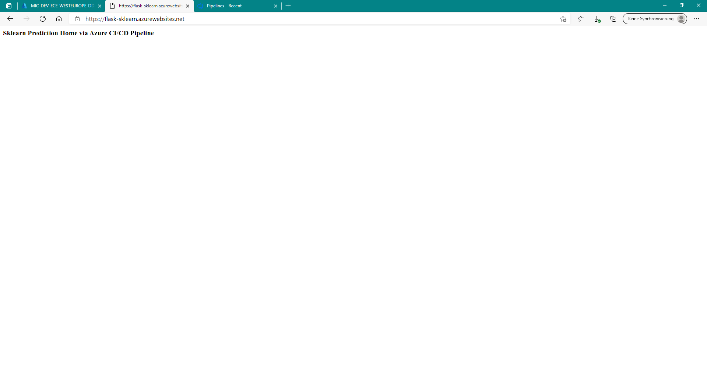


## Enhancements

<TODO: A short description of how to improve the project in the future>

## Demo 

<TODO: Add link Screencast on YouTube>


